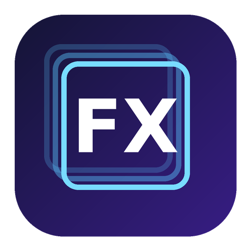
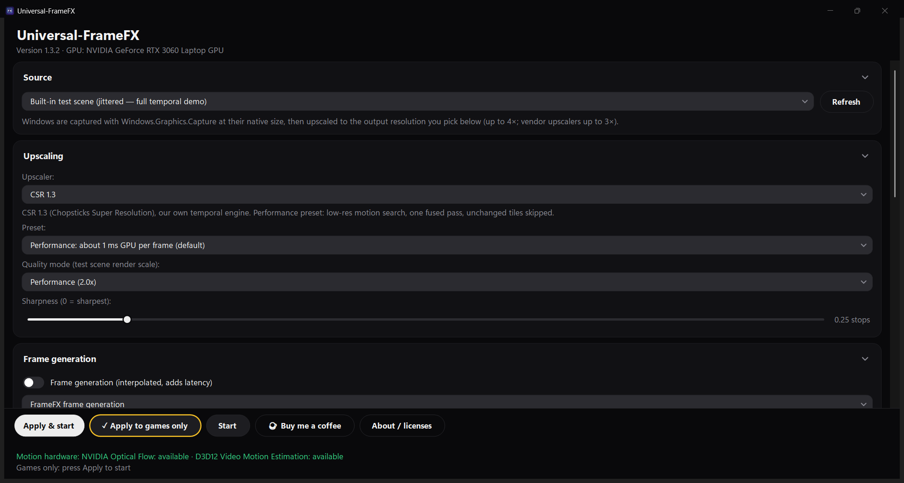

<p align="center"></p>

# Universal-FrameFX

**Free real-time upscaler and frame generator for Windows**: sharper, smoother games and apps in a click-through overlay.
No account · no telemetry · FrameFX itself needs no admin rights.

**Canonical site:** [https://chopstickshq.com/universal-framefx/](https://chopstickshq.com/universal-framefx/)
**Hub:** [https://chopstickshq.com/](https://chopstickshq.com/)

[](https://chopstickshq.com/universal-framefx/)
[](https://chopstickshq.com/universal-framefx/)
[](LICENSE)
[](https://github.com/ilikemacos/universal-framefx/actions/workflows/build.yml)

---

## Install (Windows 10 2004+ / Windows 11, x64)

**Recommended: PowerShell** (per-user, no admin; checks the download's SHA-256 before installing):

```powershell
irm https://chopstickshq.com/universal-framefx/install.ps1 | iex
```

The script is [`installer/install.ps1`](installer/install.ps1) in this repo, so you can read it before you run it.

Or:

1. Download the **.zip** from [chopstickshq.com/universal-framefx](https://chopstickshq.com/universal-framefx/).
2. Unzip it anywhere and run **Universal-FrameFX.exe**.
3. The exe isn't code-signed, so Windows SmartScreen may warn on first launch ("More info" → "Run anyway").
   The zip's SHA-256 is published on the site and in
   [`latest.json`](https://chopstickshq.com/universal-framefx/latest.json).

---

## Screenshots

<p align="center"></p>
<p align="center"><sub>Main window (screenshot from 1.3.2 on an RTX 3060 Laptop GPU, Windows 11).</sub></p>

---

## Why Universal-FrameFX

- **Free.** Works with almost any game or app window: no game support needed.
- **Nothing injected.** It captures the window picture through Windows' own capture API and draws an overlay on top.
- **No account, no telemetry.** The only network request is the update check (details below).
- **Open source app.** Everything that touches your PC (networking, updater, installer, capture setup, files and
  processes) is in this repo under the MIT licence. Only the image-processing engine is closed (see below).

---

## Features

- Upscaling with the built-in CSR options, or AMD FSR 1/2/3/4 and Intel XeSS where your GPU supports them
- Frame generation up to 4× (8× as an advanced option)
- "Apply to games only": turns itself on for games and pauses on the desktop, browsers and normal apps
- Performance, Quality and Competitive presets, and a latency budget that keeps added response time low
- Ray-traced lighting (experimental, off by default): extra light, reflections and contact shadows, including on cards without hardware ray tracing such as the GTX 1050 Ti and GTX 980 Ti
- Shows FrameFX's output fps next to the game's own fps, and warns when the game is in exclusive fullscreen
- Ctrl+Alt+F hides/shows the overlay, Ctrl+Alt+Q stops it, and Ctrl+Alt+C turns compare on or off (FrameFX processing off). Those hotkeys are registered only while an output is running
- CPU section (off by default, remembered per game): optional help while a game is running. It can't make the CPU faster than its hardware. Everything is undone when the game closes, when FrameFX closes, or with Restore defaults. A quick benchmark lets you compare before and after. Some power options may ask for admin approval

**Requires:** Windows 10 version 2004 (build 19041) or later, 64-bit, a DirectX 11 GPU.

---

## Open source, with one closed part

This repository contains the full source of the Universal-FrameFX **app** under the **MIT licence**: the window
and settings UI, game detection, window capture setup, the overlay window, the updater, the installer script, and
every piece of code that touches the network, files, other processes or the desktop. It's public so you can check
exactly what FrameFX does on your PC, and you're free to use, change and share it under the MIT terms.

**The image-processing engine (upscaling, frame generation and image effects) is proprietary and closed source.
It isn't in this repository and isn't covered by the MIT licence.** The release zip also ships third-party
runtimes (AMD FidelityFX, Intel XeSS) under their own licences; see [NOTICE.md](NOTICE.md).
[`Engine/EngineContract.cs`](Engine/EngineContract.cs) shows the boundary: the app hands the engine the captured
window picture and your settings, and the engine draws the result into FrameFX's own output window.

Engine-only command-line modes (the installer's `--selftest` GPU check and a build-time cache step) are left out
of the public `Program.cs`. Building this repository gives you the app with a placeholder engine. The UI,
settings, game detection and updater all run, but starting an output tells you the engine isn't included.
Release builds contain the closed engine, so they can't be rebuilt byte-for-byte from this source.

---

## What FrameFX does and doesn't do on your PC

Everything below can be checked in this repository. The file that proves each point is linked.

### Network: one update check, no telemetry

- FrameFX makes no network connections apart from the updater ([`Updater.cs`](Updater.cs)).
  There are no analytics, no telemetry, no crash uploads, no accounts and no ads.
- **The update check** is one HTTPS `GET` of `https://chopstickshq.com/universal-framefx/latest.json?t=<current time>`.
  The `t` value only stops caches from serving an old copy. The only information sent is what any HTTPS request
  carries (your IP address and standard headers) plus a `User-Agent: Universal-FrameFX/<version>` header. Nothing
  about your PC, your games or your settings is sent.
- The check runs at startup and then every 6 hours, but only while **"Automatically check for updates"** is on
  (Settings, on by default). Turn it off and FrameFX makes no network requests unless you click "Check now".
- If an update is found, the zip is downloaded from the HTTPS URL listed in `latest.json` (currently
  `https://chopstickshq.com/universal-framefx/…zip`). **"Install updates automatically" is off by default.**
  While it's off, nothing is downloaded until you click Install.
- Non-HTTPS URLs are refused. The only exception is a developer test override (`UFX_UPDATE_URL` environment
  variable), which can point at a local file or `localhost`.
- The "Website" and "Buy me a coffee" buttons just open the page in your browser.
- The closed engine contains no networking code.

### How updates are verified

- [`Updater.cs`](Updater.cs) streams the download through SHA-256 and checks both the size and
  the hash against `latest.json`. If either doesn't match, the file is deleted and nothing is installed (the
  refusal is written to `update.log`).
- Before it replaces any files, the updater checks that the zip contains a valid 64-bit Windows `Universal-FrameFX.exe`.
  It also refuses zip entries whose paths would land outside the install folder.
- The update is applied by a copy of FrameFX itself (`updates\helper\Universal-FrameFX-updater.exe`) after the app
  has closed. The helper backs up the current version first. If the new version doesn't report a good start within
  60 seconds, the backup is restored and that version is never auto-installed again.
- The installer script ([`installer/install.ps1`](installer/install.ps1)) works the same way: it checks the zip's
  SHA-256 against `version.json` on chopstickshq.com and installs nothing if it doesn't match.

### Admin rights

- FrameFX itself asks for normal user rights only (`asInvoker` in [`app.manifest`](app.manifest)).
  The app is never relaunched elevated, and nothing asks for administrator approval unless you turn on a CPU power option.
- The installer is per-user: it installs to `%LOCALAPPDATA%\Programs\Universal-FrameFX`, adds a Start Menu
  shortcut and runs FrameFX's GPU self-test once. It also removes leftover Start Menu shortcuts from the old
  PowerShell-based "Universal FrameFX" tool (v0.x). It doesn't touch Program Files, the registry, services,
  drivers or scheduled tasks, and it doesn't add FrameFX to startup.
- FrameFX's code doesn't read or write the registry, and FrameFX doesn't start with Windows.
  Optional CPU power options (off unless you turn them on) change the power plan through `powercfg`, not the registry.
  That plan is put back afterwards (see below).
- Only those CPU power options may show one Windows administrator prompt (`runas` on `powercfg` / `cmd.exe`)
  when a normal-user `powercfg` call is refused. Declining it is remembered until you edit the CPU section.
  The other CPU options do not ask for admin. See [`CpuBoostWin.cs`](CpuBoostWin.cs).

### What FrameFX reads from games and other apps

- **The picture of the window you choose.** [`WindowCapture.cs`](WindowCapture.cs) uses
  Windows' own screen-capture API (Windows.Graphics.Capture), the same one used by OBS and the Windows Snipping Tool.
  It gets the image Windows has already drawn on screen, including the mouse cursor. On Windows 10, Windows shows
  a yellow border around a captured window; on Windows 11, FrameFX asks Windows to leave the border off.
- **Nothing is injected into games.** FrameFX doesn't load code into other processes, hook them, or change their
  memory or files. There is no `WriteProcessMemory`, `ReadProcessMemory`, `CreateRemoteThread`, `SetWindowsHookEx`
  or DLL injection anywhere in FrameFX, including the closed engine.
- **Optional CPU section** ([`CpuBoost.cs`](CpuBoost.cs), [`CpuBoostWin.cs`](CpuBoostWin.cs)), off by default.
  While a game is running it can set that game's priority to High (never Realtime) and listed background apps to
  Below Normal, place them on chosen CPU sets (processor affinity when CPU sets aren't available), ask Windows
  not to power-throttle the game, lower FrameFX's own priority, and request a 1 ms timer. It can also switch the
  active power plan to a FrameFX-owned copy (`FrameFX Gaming`, made with `powercfg /duplicatescheme`) while gaming.
  All of that is restored when the game closes, when FrameFX closes, when you click Restore defaults, and on the
  next start if the process crashed (a fatal unhandled exception also tries to restore immediately). It does not
  read or write other processes' memory.
- **No input is sent in normal use.** The only `SendInput` calls are in a developer self-check
  (`--demo --overlay --exit-after N` on the command line). It clicks once through FrameFX's own overlay and presses
  FrameFX's own Ctrl+Alt+F/Q hotkeys to test that click-through and the hotkeys work.
- **Game detection** ([`GameDetector.cs`](GameDetector.cs)) runs only while "Apply to games
  only" is on. Twice a second it looks at the foreground window and asks Windows for:
  - the program's file path and start time (`OpenProcess` with `PROCESS_QUERY_LIMITED_INFORMATION`, the lowest
    access level);
  - the list of DLL names it has loaded (a standard Toolhelp module snapshot, which Windows creates on FrameFX's
    behalf), to see whether it uses Direct3D, Vulkan or OpenGL;
  - whether it sits in a known game-launcher folder (Steam, Epic, Xbox and so on).

  It doesn't read any game data or memory contents.
- **Anti-cheat:** FrameFX doesn't interact with anti-cheat software and makes no claims about it. It doesn't inject
  or modify anything, but whether a particular anti-cheat accepts an overlay or screen capture is up to that game.
- **The overlay** ([`OutputForm.cs`](OutputForm.cs)) is a normal top-most window that clicks pass
  through. It is never activated, so the game keeps keyboard and mouse focus. It moves to follow the game window but
  never resizes or changes the game window. It's excluded from screen capture, so FrameFX never captures itself.
  This also means screenshots and recordings show the original game image, not FrameFX's output.
- **Hotkeys:** Ctrl+Alt+F (hide/show the overlay), Ctrl+Alt+Q (stop) and Ctrl+Alt+C (compare on/off) are registered
  with `RegisterHotKey` only while an output is running, and released when it stops. There is no keyboard hook or
  keylogging.

### Files FrameFX writes

| What | Where |
|---|---|
| The program (installer or updater) | `%LOCALAPPDATA%\Programs\Universal-FrameFX\` |
| Previous version kept by the updater | `%LOCALAPPDATA%\Programs\Universal-FrameFX.prev\` |
| Your settings and per-game profiles | `%APPDATA%\Universal-FrameFX\ui.json` |
| CPU restore book (previous power plan, timer, and process priority / CPU sets, so a crash can be undone). Removed when the book is empty | `%APPDATA%\Universal-FrameFX\cpu-restore.json` |
| Startup timing log, crash log (`crash.log`, rotated at 512 KB) | `%LOCALAPPDATA%\Universal-FrameFX\` |
| Update log, downloaded update zips, updater helper | `%LOCALAPPDATA%\Universal-FrameFX\updates\` |
| GPU program cache (only file the engine writes) | `%LOCALAPPDATA%\Universal-FrameFX\shadercache\` |
| Installer self-test result | `%LOCALAPPDATA%\Programs\Universal-FrameFX\selftest.txt` |

Per-game profiles (preset, frame generation, SSGI, steadier lighting, ray-traced lighting, upscaler, output resolution and CPU options for each game)
are stored locally in that `ui.json`. Nothing about them is sent anywhere.

CPU power steps also write short-lived `ufx-cpu-*` scripts under the temp folder and delete them when the step finishes.

Logs stay on your PC. They're never uploaded. Settings → "Open logs folder" shows them. Developer diagnostics
(command-line `--out` reports and `UFX_*` test variables) write files only to paths you give them.
The code is in [`Diag.cs`](Diag.cs), [`Updater.cs`](Updater.cs) and
`UiSettings` in [`MainForm.cs`](MainForm.cs).

### Other programs FrameFX starts

- The updater helper described above, and the new or restored FrameFX after an update.
- Your browser (website, Buy me a coffee) and File Explorer ("Open logs folder"), only when you click them.
- `powercfg.exe`, and `cmd.exe` only if a CPU power option needs the one administrator prompt above. Nothing else is started for the CPU section.

### What the closed engine loads

The engine uses Direct3D 11/12 on your GPU. It loads only these:

- the AMD FidelityFX and Intel XeSS runtimes (shipped unmodified in the zip, see [`NOTICE.md`](NOTICE.md)), from
  the program folder;
- `ssgi.dll` from the program folder (the experimental SSGI option);
- NVIDIA's optical-flow component, which ships with the NVIDIA driver, if it's present.

It has no network, registry or process code. The only file it writes is the GPU program cache listed above.

## Uninstall

1. Close FrameFX (Ctrl+Alt+Q stops an output; then close the window).
2. Run the installer with `-Uninstall`. It closes FrameFX if it's running, then removes the program folder and the
   Start Menu shortcut:

   ```powershell
   & ([scriptblock]::Create((irm https://chopstickshq.com/universal-framefx/install.ps1))) -Uninstall
   ```

   If you used the zip, just delete the folder you unzipped.
3. The uninstaller leaves your settings, logs and the update backup in place. To remove everything, also delete:
   - `%APPDATA%\Universal-FrameFX`
   - `%LOCALAPPDATA%\Universal-FrameFX`
   - `%LOCALAPPDATA%\Programs\Universal-FrameFX.prev`

FrameFX leaves nothing else behind: no registry keys, services, drivers or startup entries.
Closing FrameFX restores the previous power plan and deletes the `FrameFX Gaming` plan the optional CPU section may have created.
If the process was killed, the next start does that restore from `cpu-restore.json`. The uninstaller does not remove a power plan by itself, so close FrameFX (or start it once) before you uninstall.

---

## Build from source

Requirements: .NET 8 SDK. Windows is needed to run the app; it can also be built on Linux or macOS with
`-p:EnableWindowsTargeting=true`.

```
dotnet build -c Release
```

[`.github/workflows/build.yml`](.github/workflows/build.yml) builds it on every push.

### Repository layout

| Path | What it is |
|------|------------|
| `MainForm.cs`, `Theme.cs` | Main window, settings UI, saved settings (`ui.json`) |
| `OutputForm.cs` | Overlay / output window, hotkeys, HUD |
| `WindowCapture.cs` | Window capture (Windows.Graphics.Capture) |
| `GameDetector.cs` | "Apply to games only" detection |
| `GameProfiles.cs` | Per-game profiles saved locally in `ui.json` |
| `Updater.cs` | Update check, SHA-256 verified download, install and rollback |
| `Diag.cs` | Startup and crash logs, GPU program cache |
| `Native.cs`, `Beta2.cs`, `Program.cs` | Windows API declarations, version and hints, entry point |
| `CpuBoost.cs`, `CpuBoostWin.cs` | Optional CPU section: settings, what it changes, and how it is restored |
| `Engine/` | Boundary to the closed engine, plus the placeholder used in public builds |
| `installer/install.ps1` | The one-line installer and uninstaller |
| `licenses/`, `NOTICE.md` | Third-party licences and notices |

---

## Contributing

Bug reports and pull requests for the app are welcome. See [CONTRIBUTING.md](CONTRIBUTING.md).
Security issues: please report them privately, see [SECURITY.md](SECURITY.md).

---

## Chopsticks HQ

| Product | URL |
|---------|-----|
| **HQ hub** | https://chopstickshq.com/ |
| **Universal-FrameFX** | https://chopstickshq.com/universal-framefx/ |
| **MacBar** | https://chopstickshq.com/macbar/ |
| **cs.AI** | https://chopstickshq.com/chopsticks-ai/ |
| **Fathom** | https://chopstickshq.com/fathom/ |

---

## Support

- Issues: [github.com/ilikemacos/universal-framefx/issues](https://github.com/ilikemacos/universal-framefx/issues)
- Site: [chopstickshq.com/universal-framefx](https://chopstickshq.com/universal-framefx/)
- Buy me a coffee: [buymeacoffee.com/chopstickshq](https://buymeacoffee.com/chopstickshq)

---

## License

The app source in this repository is MIT. See [LICENSE](LICENSE). The closed FrameFX engine isn't covered by
it. Third-party components keep their own licences: see [NOTICE.md](NOTICE.md) and [`licenses/`](licenses/).
